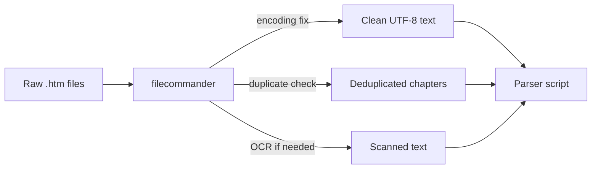
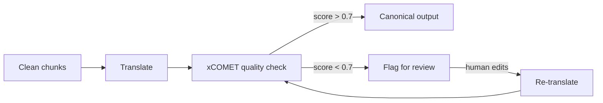
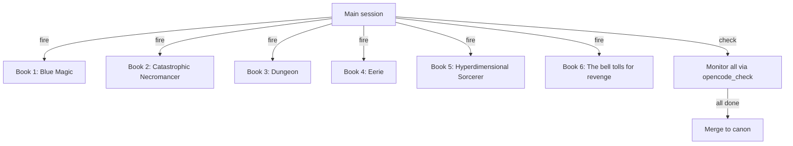

# MCP Integration for Translation Pipeline

How the installed MCP servers improve and automate the 7-book translation pipeline.

## Current Pipeline Bottlenecks

| Problem | Current workaround | MCP solution |
|---------|------------------|-------------|
| Raw .htm files have encoding issues | Manual fix per file | `filecommander` — encoding detection/repair, batch fix |
| Duplicate books/chapters detected late | Manual inventory checks | `filecommander` — SHA-256 duplicate detection across 7 books |
| Translation quality varies per chapter | Manual spot-checking | `xcomet` — automated quality scoring (0-1) per chapter |
| Errors in translation found post-hoc | Manual review loops | `xcomet` — error detection with severity levels (minor/major/critical) |
| Files need OCR for scanned images | Skip or manual OCR | `filecommander` — Tesseract OCR integration |
| Pipeline steps require sequential attention | Manual orchestration | `opencode-mcp` — fire-and-forget per-book processing in parallel |
| Meeting notes/architecture docs | Manual diagramming | `drawio` — generate pipeline architecture diagrams from prompts |
| Context lost between pipeline runs | Manual re-reading of previous output | `memory` — persistent knowledge graph remembers per-book state |

## Workflow Integration

### Phase 1: Pre-processing (raw → clean)



**MCPs used**: `filecommander` (encoding fix, duplicate detection, OCR)

**Commands**:
```bash
# Extract text from .htm
python scripts/extract_html.py

# Fix encoding issues
filecommander fix-encoding --recursive raw/

# Detect duplicates across books
filecommander detect-duplicates --recursive --min-size 1000

# OCR any scanned pages
filecommander ocr --language jpn raw/page_001.png
```

### Phase 2: Translation & QC



**MCPs used**: `xcomet` (quality scoring, error detection)

**xCOMET quality thresholds**:

| Score | Action |
|-------|--------|
| 0.0 - 0.5 | Re-translate needed |
| 0.5 - 0.7 | Flag for human review |
| 0.7 - 0.9 | Minor fixes, auto-approve |
| 0.9 - 1.0 | Auto-approve |

**Script integration** (`pipe.sh` additions):

```bash
# Role 8: Quality check (add to pipe.sh)
if [ "$ROLE" = "8" ]; then
    opencode ask "Run xCOMET quality evaluation on chapter $CHAPTER"
    SCORE=$(opencode ask "Get score from xCOMET for last translation")
    if (( $(echo "$SCORE < 0.7" | bc -l) )); then
        echo "QUALITY FAIL: $SCORE — flagging for review"
        mv "$OUTPUT" "$WORK/needs-review/$CHAPTER"
    fi
fi
```

### Phase 3: Parallel Processing



**MCPs used**: `opencode-mcp` (fire-and-forget sessions)

```bash
# Fire off per-book processing in parallel
opencode fire --prompt "Run translation pipeline on Blue Magic, book 01"
opencode fire --prompt "Run translation pipeline on Catastrophic Necromancer, chapters 100-200"

# Check status of all
opencode check --session <id>
```

### Phase 4: Documentation

**MCPs used**: `drawio`, `memory`, `sequential-thinking`

```bash
# Generate pipeline diagram for vault docs
opencode ask "Create a drawio diagram of the translation pipeline showing input→chunk→translate→QC→canon"

# Log session decisions to persistent memory
opencode ask "Save to memory: Blue Magic chapter 45 needed re-translation because of complex honorifics"

# Structured problem-solving for pipeline issues
opencode ask "Use sequential thinking to debug why chapters 50-60 keep failing quality checks"
```

## Script Integration Points

### pipe.sh Role Additions

Current pipe.sh roles: 0=parser, 1=glossary, 2=briefer, 3=translator, 4=editor, 5=script-checks, 6=style-auditor, 7=consistency, 8=verifier, 9=continuity

New MCP-augmented roles:

| Role | MCP | What it adds |
|------|-----|-------------|
| 0 (parser) | `filecommander` | Encoding detection before parsing. Fixes mojibake in raw .htm. |
| 1 (glossary) | `sequential-thinking` | Structured term extraction — forces LLM to think step by step about context-appropriate translations. |
| 3 (translator) | `getlinnk` or `general-translation` | Alternative translation engine for books where current model struggles. |
| 8 (verifier) | `xcomet` | Automated quality scoring replaces manual spot-checking. Sets pass/fail threshold. |
| 8 (verifier) | `memory` | Stores per-chapter quality scores for trend analysis. Flags degrading quality early. |

### New pipe.sh Role: QC

```bash
# Role 10: MCP-based quality check
ROLE_10() {
    local CHAPTER="$1"
    local SOURCE="$CLEAN_DIR/$CHAPTER"
    local TRANSLATION="$OUTPUT_DIR/$CHAPTER"

    # xCOMET quality evaluation
    opencode ask --model=fast "
        Use xcomet_evaluate to score this translation:
        Source: $(cat "$SOURCE")
        Translation: $(cat "$TRANSLATION")
        source_lang: ja, target_lang: en
    " 2>&1 | tee "$WORK/xcomet-$CHAPTER.json"

    # Parse score and decide
    local SCORE=$(python3 -c "import json; d=json.load(open('$WORK/xcomet-$CHAPTER.json')); print(d.get('score', 0))")
    if (( $(echo "$SCORE < 0.5" | bc -l) )); then
        echo "FAIL ($SCORE) — needs re-translation"
        return 1
    elif (( $(echo "$SCORE < 0.7" | bc -l) )); then
        echo "WARN ($SCORE) — needs human review"
        return 2
    else
        echo "PASS ($SCORE)"
        return 0
    fi
}
```

## MCP Configuration for Pipeline

```json
{
  "xcomet": {
    "env": {
      "XCOMET_PYTHON_PATH": "/mnt/workspace/xcomet-venv/bin/python3",
      "XCOMET_MODEL": "Unbabel/wmt22-comet-da"
    }
  }
}
```

For GPU-accelerated xCOMET (P40, 24GB):

```bash
export CUDA_VISIBLE_DEVICES=1  # P40
export XCOMET_MODEL=Unbabel/XCOMET-XL  # after access granted
```

## See Also

- [[software/opencode/mcp-inventory]]
- [[software/opencode/plugins]]
- [[Translation Pipeline]]
- [[Hyperdimensional Sorcerer Pipeline]]
